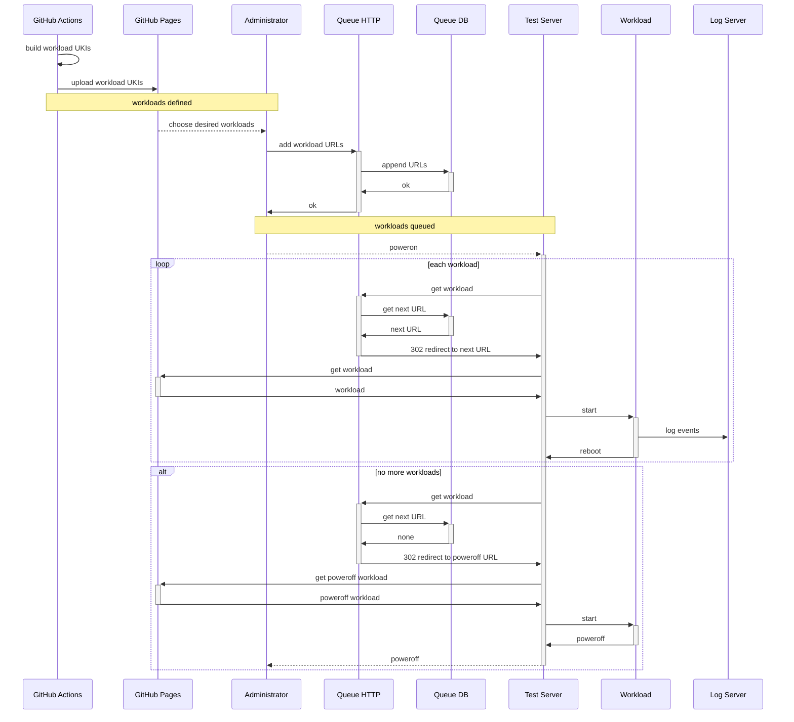

The following flowchart details how workload images (UKIs) are created, queued for execution, and executed.

```mermaid
sequenceDiagram
    participant gha as GitHub Actions
    participant ghp as GitHub Pages
    participant admin as Administrator
    participant qhttp as Queue HTTP
    participant qdb as Queue DB
    participant server as Test Server
    participant workload as Workload
    participant collector as Log Server

    gha->>gha: build workload UKIs
    gha->>ghp: upload workload UKIs

    note over gha,admin: workloads defined

    ghp-->>admin: choose desired workloads
    admin->>+qhttp: add workload URLs
    qhttp->>+qdb: append URLs
    qdb->>-qhttp: ok
    qhttp->>-admin: ok

    note over admin,server: workloads queued

    admin-->>+server: poweron

    loop each workload
        server->>+qhttp: get workload
        qhttp->>+qdb: get next URL
        qdb->>-qhttp: next URL
        qhttp->>-server: 302 redirect to next URL

        server->>+ghp: get workload
        ghp->>-server: workload

        server->>+workload: start
        workload->>collector: log events
        workload->>-server: reboot
    end

    alt no more workloads
        server->>+qhttp: get workload
        qhttp->>+qdb: get next URL
        qdb->>-qhttp: none
        qhttp->>-server: 302 redirect to poweroff URL
    
        server->>+ghp: get poweroff workload
        ghp->>-server: poweroff workload

        server->>+workload: start
        workload->>-server: poweroff

        server-->>-admin: poweroff
    end
```
